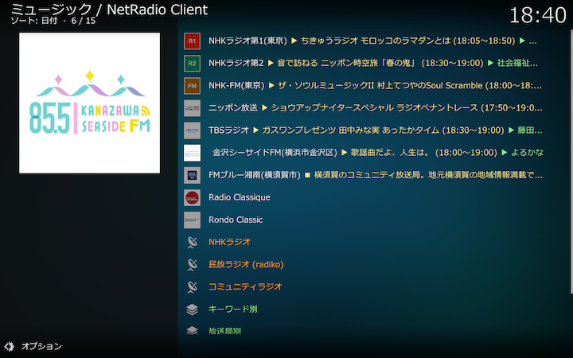

## Kodiアドオン：ネットラジオクライアント

[NHKラジオ](http://www.nhk.or.jp/radio/)、[民放ラジオ（radiko.jp）](http://radiko.jp)、[コミュニティラジオ](docs/コミュニティラジオ一覧.md)が提供するインターネットラジオ放送を聴いたり、番組をオーディオファイルとして保存するKodiアドオンです。

Windows、macOSで動作検証しています。

## 目次

[概要](docs/概要.md)

[トップ画面](docs/トップ画面.md)
* [放送局リスト](docs/放送局リスト.md)
* 放送局ディレクトリ
  * [NHKラジオ](docs/放送局ディレクトリ（NHKラジオ）.md)
  * [民放ラジオ (radiko)](docs/放送局ディレクトリ（民放ラジオ）.md)
  * [コミュニティラジオ](docs/放送局ディレクトリ（コミュニティラジオ）.md)
* 保存番組ディレクトリ
  * [キーワード別](docs/保存番組ディレクトリ（キーワード別）.md)
  * [放送局別](docs/保存番組ディレクトリ（放送局別）.md)
  * [日付別](docs/保存番組ディレクトリ（日付別）.md)

[アドオン設定画面](docs/アドオン設定画面.md)

[放送局設定画面](docs/設定画面（放送局）.md)

[タイマー設定画面](docs/設定画面（タイマー）.md)

[キーワード設定画面](docs/設定画面（キーワード）.md)

[コミュニティラジオ一覧](docs/コミュニティラジオ一覧.md)
