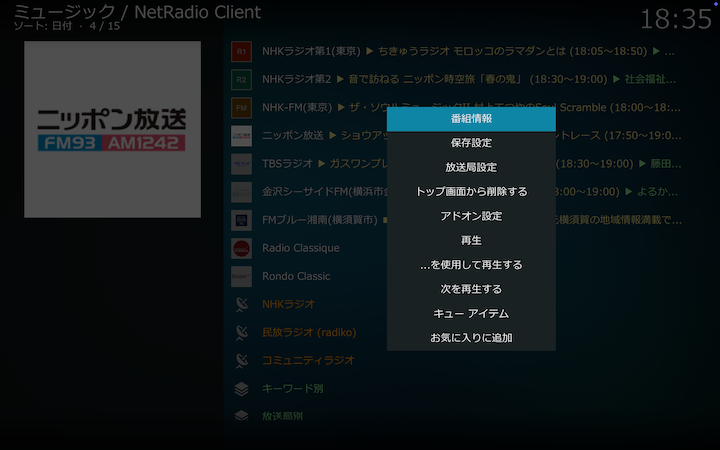
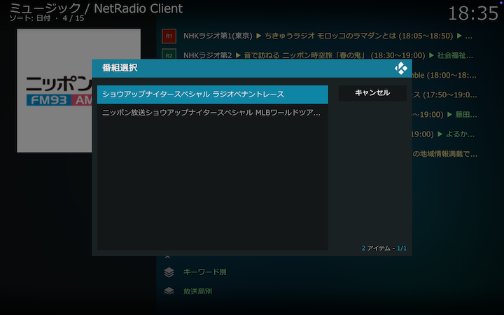
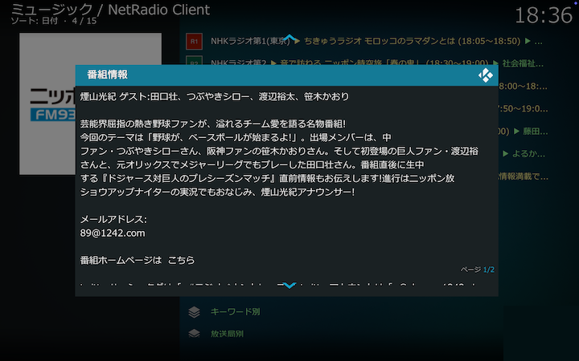
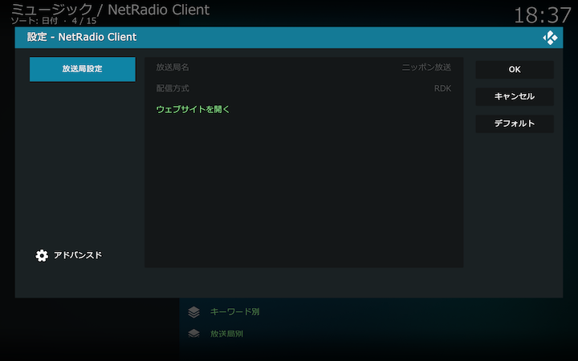
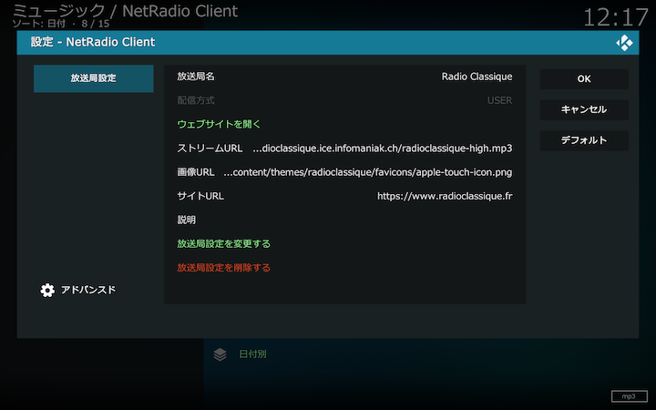

## 放送局リスト

放送局を選択して現在放送中の番組を聴くことができます。初めて起動した直後は、radikoの認証で判定された地域にしたがって、その地域で聴取できるNHKラジオおよび民放ラジオのすべての放送局が放送局リストとして表示されます。

### 放送局リストの編集

[放送局ディレクトリ](./アドオン画面（放送局ディレクトリ）.md)から選択した放送局や、[放送局設定画面](./330_設定画面（放送局）.md)で設定した放送局をこのリストに追加できます。放送局を削除する場合は、放送局を右クリックして表示されるコンテクストメニューから「アドオン画面から削除する」を選択してください。

### コンテクストメニュー

放送局リストの放送局を右クリックして表示されるコンテクストメニューから以下の操作ができます。

#### 番組情報

表示されるダイアログをたどって番組情報を表示します。

#### 保存設定

表示されるダイアログをたどって番組を保存します。詳しくは[こちら](./903_放送局リストから番組保存.md)をご覧ください。

#### 放送局設定

表示されるダイアログから放送局の公式サイトをブラウザで開くことができます。

ユーザ設定の放送局については設定の変更や削除ができます。詳しくは[こちら](./330_設定画面（放送局）.md)をご覧ください。

#### アドオン画面から削除する

選択した放送局をアドオン画面の放送局リストから削除します。放送局ディレクトリからは削除されないので、削除した後でも、放送局ディレクトリのコンテクストメニューの操作により改めて追加することができます。ユーザ設定の放送局については[放送局設定画面](./330_設定画面（放送局）.md)から削除してください。

#### アドオン設定

[アドオン設定画面](200_アドオン設定画面.md)をご覧ください。

