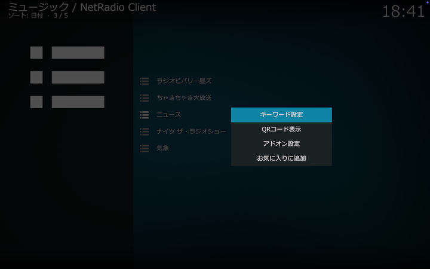

## 保存番組ディレクトリ（キーワード別）

キーワード設定で保存された番組をキーワード別に一覧できます。

以下は「ニュース」を選択して、キーワード設定にマッチした保存番組を一覧表示した例です。

保存が完了している番組はタイトルの文字がカーキ（黄色）で表示され、クリックするとそのまま再生されます。詳しくは[こちら](./902_保存番組の操作.md)をご覧ください。

### コンテクストメニュー

キーワードを右クリックして表示されるコンテクストメニューから以下の操作ができます。

#### キーワード設定

キーワード設定を変更、削除します。詳しくは[こちら](./310_設定画面（キーワード）.md)をご覧ください。

#### QRコード表示

キーワード別RSSのURLを埋め込んだQRコードを表示します。[アドオン設定](./200_アドオン設定画面.md#番組保存)でRSS生成がオンでない場合はこのメニューは表示されません。

以下は「ニュース」のRSSのURLを埋め込んだQRコードを表示した例です。

この例では、[アドオン設定](./200_アドオン設定画面.md#番組保存)で保存フォルダに対応するURLが _http\://127.0.0.1/NetRadio/_ とされていて、「ニュース」のキーワード設定に付されたIDが3であることから、RSSのURLは _http:\/\/127.0.0.1/NetRadio/3/rss.xml_ となっています。
