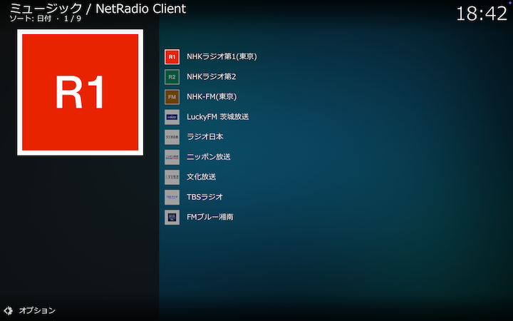
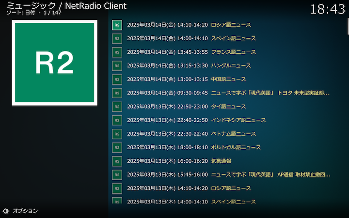
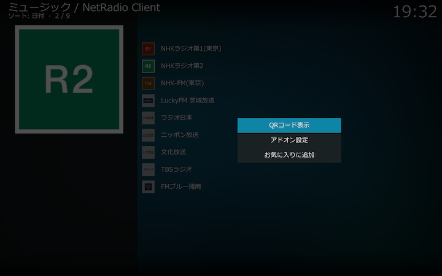
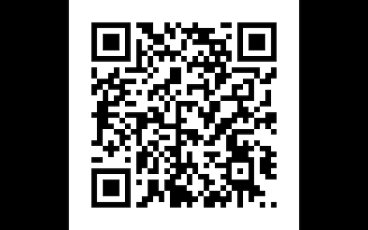

### 保存番組ディレクトリ（放送局別）

すべての保存された番組を放送局別に一覧できます。

以下は「NHKラジオ第2」を選択して、NHKラジオ第2の保存番組を一覧表示した例です。

保存が完了している番組はタイトルの文字がカーキ（黄色）で表示され、選択するとそのまま再生されます。詳しくは[こちら](./902_保存番組の再生.md)をご覧ください。

### コンテクストメニュー

キーワードを右クリックして表示されるコンテクストメニューから以下の操作ができます。

#### QRコード表示

放送局別RSSのURLを埋め込んだQRコードを表示します。[アドオン設定](./200_アドオン設定画面.md#番組保存)でRSS生成がオンでない場合はこのメニューは表示されません。

以下は「NHKラジオ第2」のRSSのURLを埋め込んだQRコードを表示した例です。

この例では、[アドオン設定](./200_アドオン設定画面.md#番組保存)で保存フォルダに対応するURLが _http\://127.0.0.1/NetRadio/_ とされていて、RSSのURLは _http:\/\/127.0.0.1/NetRadio/0/NHK/NHKラジオ第2/rss.xml_ となっています。

