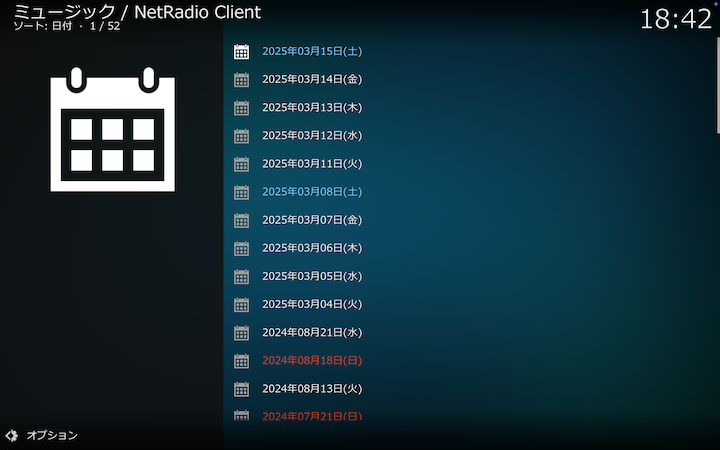
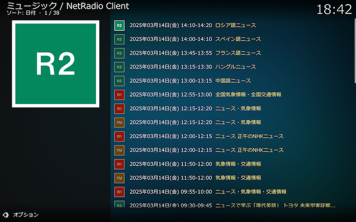

### 保存番組ディレクトリ（日付別）

すべての保存された番組を日付別に一覧できます。

以下は「2025年03月14日(金)」を選択して、2025年03月14日(金)の保存番組を一覧表示した例です。

保存が完了している番組はタイトルの文字がカーキ（黄色）で表示され、選択するとそのまま再生されます。保存中および保存予定、もしくは保存に失敗した番組はタイトルの文字がグレイで表示され、選択すると、再生、キャンセルが可能です。詳しくは[こちら](./902_保存番組の再生.md)をご覧ください。
