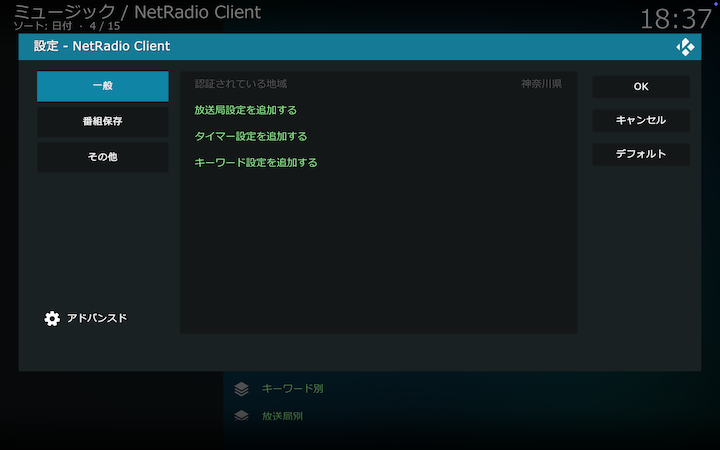
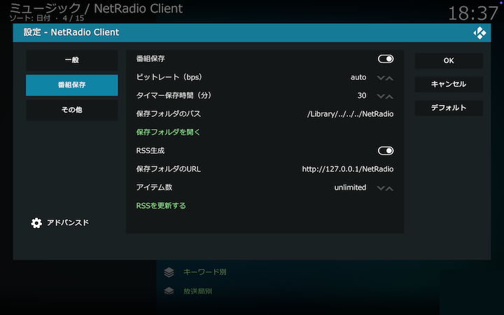
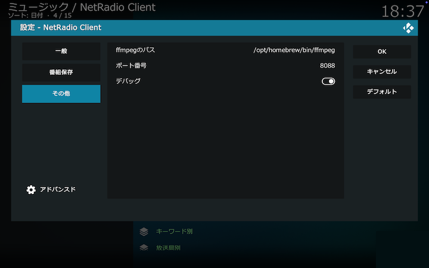

## アドオン設定画面

「一般」「番組保存」「その他」の各タブからアドオンを設定します。

### 一般

#### 認証されている地域

radikoの認証で判定された地域を表示します。

#### 放送局を追加する

放送局設定画面を開いてユーザ設定の放送局を追加します。詳しくは[こちら](./330_設定画面（放送局）.md)をご覧ください。

#### タイマー設定を追加する

タイマー設定画面を開いて保存設定を追加します。詳しくは[こちら](./320_設定画面（タイマー）.md)をご覧ください。

#### キーワード設定を追加する

キーワード設定画面を開いてキーワードを設定します。詳しくは[こちら](./310_設定画面（キーワード）.md)をご覧ください。

### 番組保存

#### 番組保存

番組保存する場合はオンにしてください。

#### ビットレート (bps)

mp3エンコード時のビットレートを指定してください。ビットレートはauto/192k/160k/128k/96k/64kから選択できます。autoを指定すると、mp3エンコード後のファイルサイズを100MB以下とする（できるだけ高い）ビットレートを自動選択します。

iOSのPodcastアプリでダウンロードできる最大サイズは100MBまでとされていますので、Podcastアプリと同期する場合はビットレートをautoとしてください。

#### タイマー保存時間 (分)

タイマー設定で番組保存する際に、番組情報が取得できず番組終了時刻が判定できない場合は、現在時刻にここで設定した時間を加えた時刻を終了時刻として番組を保存します。

#### 保存フォルダのパス

ファイルを保存するフォルダを指定してください。

#### RSS生成

RSSを生成する場合はオンにしてください。

#### 保存フォルダのURL

保存フォルダに対応するURLを設定してください。

この例のように、保存フォルダに対応するURLを _http\://127.0.0.1/NetRadio/_ とした場合、キーワード一覧は _http\://127.0.0.1/NetRadio/keywords.xml_ から、放送局一覧は _http\://127.0.0.1/NetRadio/stations.xml_ から、それぞれRSS形式で取得できます。各キーワード毎、各放送局毎のRSSのリンクは、キーワード一覧、放送局一覧のRSSにそれぞれ記述されています。

#### アイテム数

RSSに格納するファイル情報の数を指定してください。
ファイル情報の数は5/10/20/50/100/unlimitedから選択できます。
すべてのファイル情報を格納する場合はunlimitedを指定してください。

#### RSSを更新する

番組保存したファイル情報に基づいてRSSを更新します。
通常は番組保存の完了時に自動更新されます。

### その他

#### ffmpegのパス

番組保存や、一部のコミュニティラジオのストリーム再生のために _ffmpeg_ が必要です。[外部プログラムのインストール](./000_概要.md#外部プログラムのインストール)にしたがってインストールしてください。

_ffmpeg_ をインストールした後、そのパスがKodiアドオンで正しく認識できない場合、Kodi起動時にエラーが通知されます。OS側でパスの修正ができない場合は、ここに _ffmpeg_ のパスを設定してください。

#### ポート番号

アドオン内部に設けたプロキシ機能（ローカルプロキシ）により、放送局から各種情報を取得する際に必要な処理を行っています。このローカルプロキシが使用するポート番号を設定します（デフォルトは8088）。

他のアプリケーションが同じポート番号を使用しているなどで、Kodi起動時にエラーが通知される場合は他の番号に変更してください。ポート番号の変更後はKodiを再起動してください。

#### デバッグ

デバッグ用の設定です。 動作に関する情報をKodiのログファイルに書き出します。
