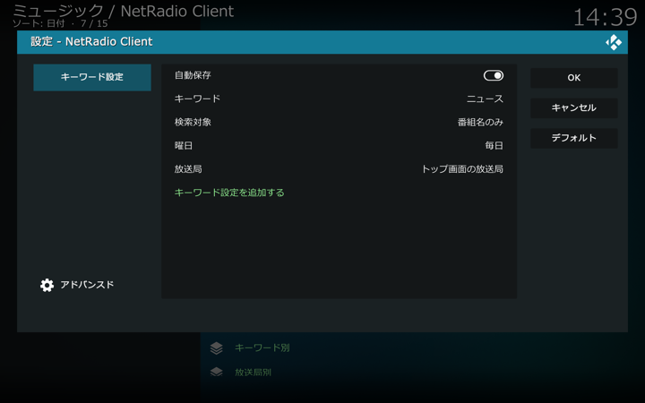
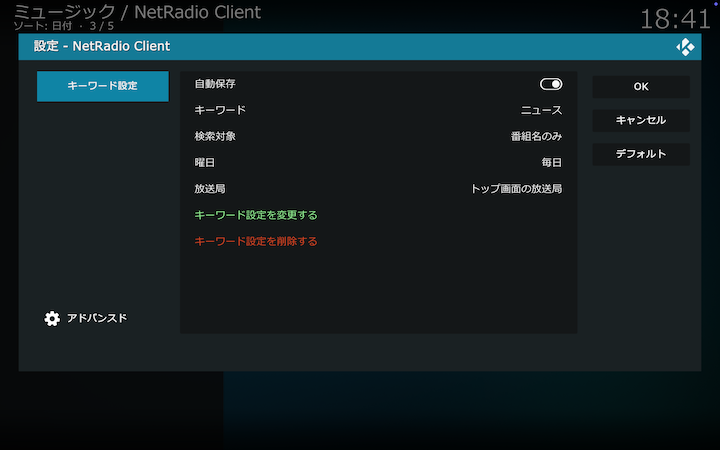

## キーワード設定画面

保存したい番組のタイトルや詳細情報にマッチさせるキーワード、放送される曜日、放送局を指定して番組保存を設定します。キーワード設定画面は[アドオン設定画面](./200_アドオン設定画面.md#一般)から開くか、放送局リストのコンテクストメニューから「保存設定」を選択して開くダイアログをたどって開くこともできます（[こちら](./903_放送局リストから番組保存.md)をご覧ください）。

### キーワード設定の設定項目

設定する項目は以下の通りです。

#### 自動保存

番組保存する際にはオンにしてください。番組保存はしないが保存済みのオーディオファイルは削除しないときはこれをオフにしてください。キーワード設定を削除するとこのキーワード設定で保存された番組のオーディオファイルも同時に削除されます。

#### キーワード

番組情報に含まれるキーワードを設定します。アドオン画面の放送局リストの番組を対象にして、ここで設定したキーワードを番組情報に含む番組が自動的に保存されます。

#### 検索対象

上記で設定したキーワードを照合する番組情報の範囲を設定します。「番組名のみ」「番組名と詳細情報」のいずれかを選択します。

#### 曜日

番組が放送される曜日を指定します。

#### 放送局

番組保存する放送局をリストから選択します。ここで選択された放送局がアドオン画面の放送局リストにない場合は、アドオン画面の放送局リストに追加されます。

#### キーワード設定を追加する

キーワード設定を追加します。「OK」を選択しても追加はされないので注意してください。

### キーワード設定の変更・削除

キーワード別保存番組ディレクトリのキーワードを右クリックして表示されるコンテクストメニューから「キーワード設定」を選択してください。

#### キーワード設定を変更する

キーワード設定を変更します。「OK」を選択しても変更はされないので注意してください。

#### キーワード設定を削除する

キーワード設定を削除します。このキーワード設定で保存された番組のオーディオファイルも同時に削除されます。

