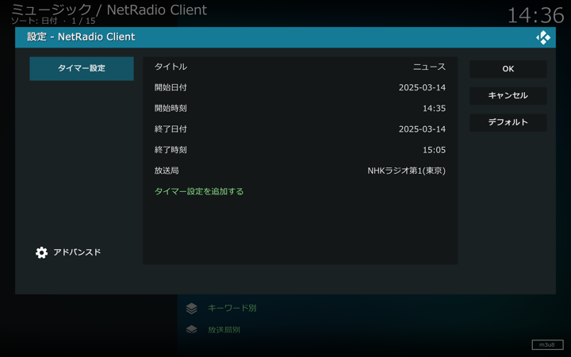

## タイマー設定画面

開始日時、終了日時、放送局を指定して番組保存を設定します。タイマー設定画面は[アドオン設定画面](./200_アドオン設定画面.md#一般)から開くか、放送局リストのコンテクストメニューから「保存設定」を選択して開くダイアログからたどって開くこともできます。詳しくは[こちら](./903_放送局リストから番組保存.md)をご覧ください。

### タイマー設定の設定項目

設定する項目は以下の通りです。

#### タイトル

ここで設定されたタイトルで、トップ画面の保存番組ディレクトリに保存されます。

#### 開始日付

番組保存を開始する日付を設定します。

#### 開始時刻

番組保存を開始する時刻を設定します。

#### 終了日付

番組保存を終了する日付を設定します。

#### 終了時刻

番組保存を終了する時刻を設定します。

#### 放送局

番組保存する放送局をリストから選択します。

#### タイマー設定を追加する

タイマー設定を追加します。「OK」を選択しても追加はされないので注意してください。

### タイマー設定の変更

タイマー設定は変更できません。番組保存の開始前であれば、放送局別または日付別保存番組ディレクトリに表示される保存予定番組をクリックして表示されるダイアログから保存をキャンセルできます。[こちら](./902_保存番組の操作.md)をご覧ください。

