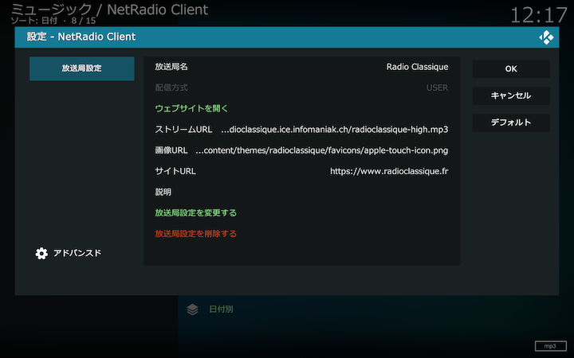

## 放送局設定画面

放送局名と配信ストリームのURLを登録してユーザ設定の放送局をトップ画面に追加できます。放送局設定画面は[アドオン設定画面](./200_アドオン設定画面.md#一般)から開くことができます。

ユーザが追加した放送局設定を変更、削除する場合は、ユーザが追加した放送局のコンテクストメニューから「放送局設定」を選択してください。

「放送局設定を追加する」「放送局設定を変更する」「放送局設定を削除する」を選択すると放送局設定が追加、変更、削除されます。「OK」を選択しても追加、変更、削除はされないので注意してください。

### 放送局設定の設定項目

設定する項目は以下の通りです。

#### 放送局名

画面に表示する放送局名を設定します。

#### ストリームURL

配信ストリームのURLを設定します。

#### 画像URL（オプション）

画面に表示するサムネイル画像のURLを設定します。指定しない場合はデフォルト画像が用いられます。

#### サイトURL（オプション）

放送局の公式ホームページのURLを設定します。コンテクストメニューの放送局設定から公式ホームページにアクセスしたり、RSSを生成するための情報として使われます。

#### 説明（オプション）

任意の情報が設定できます。設定した情報は放送局名に続いて[放送局リスト](./110_放送局リスト.md)に表示されます。

### 放送局設定の変更

ユーザが追加した放送局設定を変更、削除する場合は、ユーザが追加した放送局のコンテクストメニューから「放送局設定」を選択してください。
