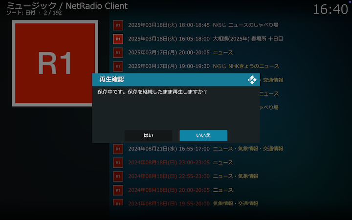
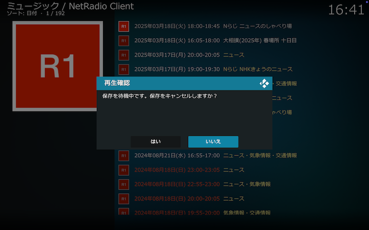
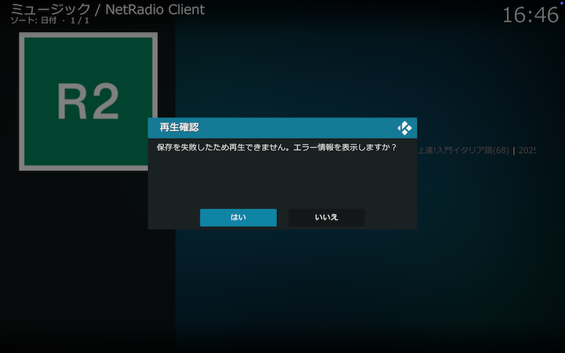
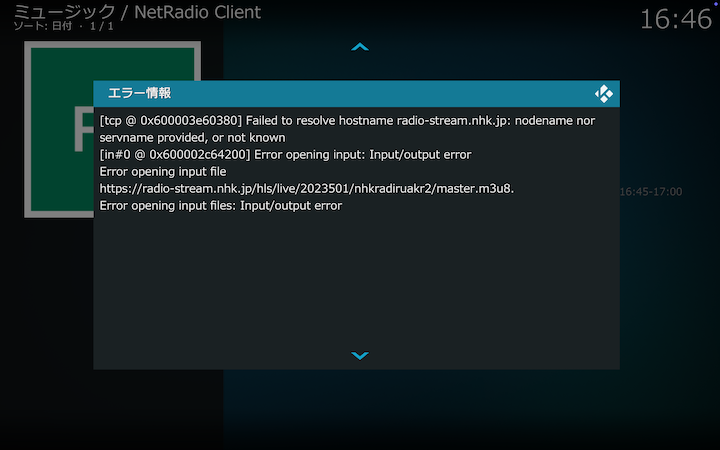

## 保存番組の操作

保存番組ディレクトリの番組一覧では、保存が完了している番組はタイトルの文字がカーキ（黄色）で表示されます。保存中および待機中、もしくは保存に失敗した番組はタイトルの文字がグレイで表示されます。

### 保存番組の再生

保存が完了している番組は、クリックするとそのまま再生されます。その場合は、そんれぞれの場合に応じて以下の操作が可能です。

#### 保存中の場合

保存中の場合は以下のダイアログが表示されます。

「はい」を選択すると保存中のファイルの先頭から再生します。

#### 待機中の場合

待機中の場合は以下のダイアログが表示されます。

「はい」を選択すると番組保存はキャンセルされます。

#### 保存に失敗している場合

保存に失敗している場合は以下のダイアログが表示されます。

「はい」を選択するとエラー情報を表示します。以下はネットワークに接続できなかったときのエラー情報の例です。

保存に失敗した番組の情報は、Kodi本体を再起動するときにクリアされます。

### 保存番組の削除

保存番組を右クリックして表示されるコンテクストメニューから「削除する」を選択してください。

