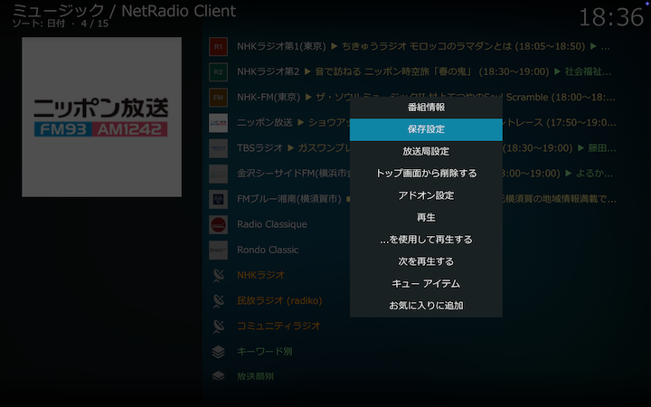
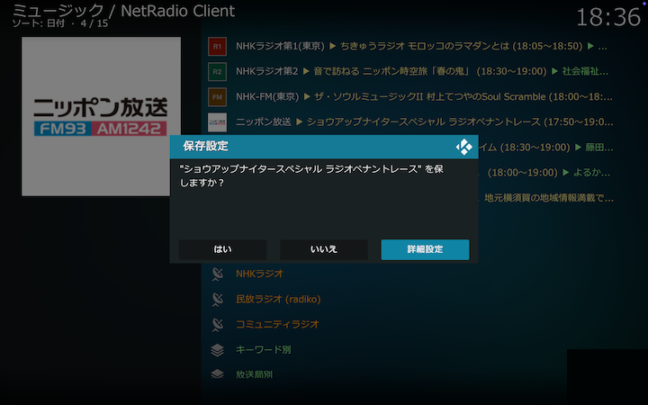
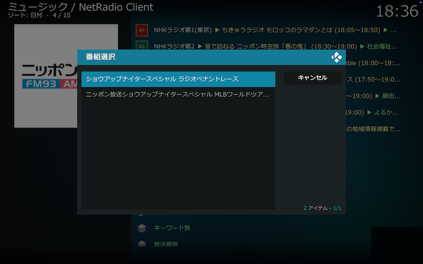
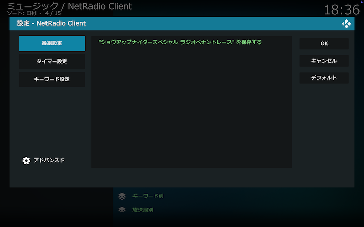
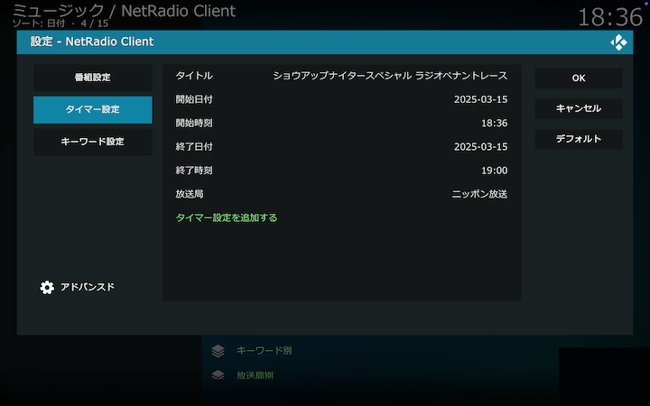
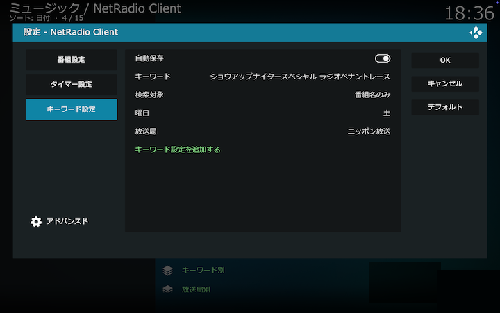

## 放送局リストから番組保存

放送局リストのコンテクストメニューから「保存設定」を選択して放送中の番組や放送予定の番組を保存できます。

現在放送中の番組を番組表の時刻にしたがって保存する場合は、保存設定画面で「はい」を選択してください。時刻を変更したり、番組のタイトルや詳細情報のキーワードにマッチした番組を自動保存する場合は、保存設定画面で「詳細設定」を選択してください。

番組選択画面で、放送中の番組、または次に放送される番組のいずれかから選択してください。ここで選択した番組のタイトル、開始時刻、終了時刻が、以降の設定画面の初期値になります。

「番組設定」「タイマー設定」「キーワード設定」のいずれかの保存設定ができます。

### 番組設定

直前の番組選択画面で選択した番組を番組単位で保存します。「...を保存する」をクリックすると番組保存を開始します。「OK」を選択しても保存されないので注意してください。

保存された番組は、アドオン画面の「[放送局別](./132_保存番組ディレクトリ（放送局別）.md)」「[日付別](./133_保存番組ディレクトリ（日付別）.md)」の各保存番組ディレクトリをたどって選択、再生できます。

### タイマー設定

開始日時、終了日時、放送局を指定して保存します。設定する項目の詳細は[タイマー設定画面](./320_設定画面（タイマー）.md#設定項目)をご覧ください。「タイマー設定を追加する」をクリックすると番組保存が設定されます。「OK」を選択しても設定されないので注意してください。

保存された番組は、アドオン画面の「[放送局別](./132_保存番組ディレクトリ（放送局別）.md)」「[日付別](./133_保存番組ディレクトリ（日付別）.md)」の各保存番組ディレクトリをたどって選択、再生できます。

### キーワード設定

保存したい番組のタイトルや詳細情報にマッチさせるキーワード、放送される曜日、放送局を指定して保存します。設定する項目の詳細は[キーワード設定画面](./310_設定画面（キーワード）.md#設定項目)をご覧ください。「キーワード設定を追加する」をクリックすると番組保存が設定されます。「OK」を選択しても設定されないので注意してください。

保存された番組は、アドオン画面の「[キーワード別](./131_保存番組ディレクトリ（キーワード別）.md)」「[放送局別](./132_保存番組ディレクトリ（放送局別）.md)」「[日付別](./133_保存番組ディレクトリ（日付別）.md)」の各保存番組ディレクトリをたどって選択、再生できます。

