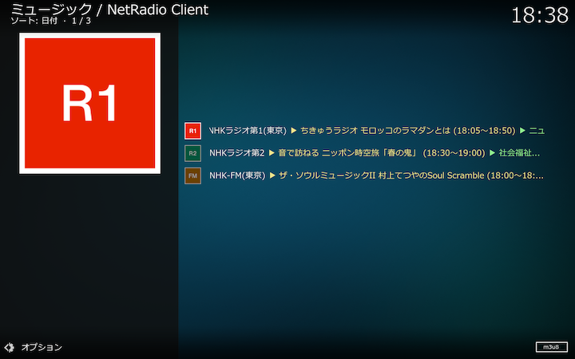

## NHKラジオ
  
radikoの認証で判定された地域にしたがって、「東京」「札幌」「仙台」「名古屋」「大阪」「広島」「松山」「福岡」のいずれかのNHKラジオ第1とNHK-FM、およびNHKラジオ第2（全国共通）が選択できます。放送局を選択して現在放送中の番組をストリーム再生できます。

#### コンテクストメニュー

放送局を右クリックして表示されるコンテクストメニューから以下の操作ができます。

##### 番組情報

表示されるダイアログをたどって番組情報を表示します。詳しくは[こちら](./放送局リスト.md#番組情報)をご覧ください。

##### 保存設定

表示されるダイアログをたどって番組保存を設定します。詳しくは[こちら](./放送局リスト（番組保存）.md)をご覧ください。

##### 放送局設定

表示されるダイアログから放送局の公式サイトをブラウザで開くことができます。詳しくは[こちら](./放送局リスト.md#放送局設定)をご覧ください。

##### トップ画面に追加する（トップ画面から削除する）

選択した放送局をトップ画面の放送局リストに追加（追加済みの場合はトップ画面の放送局リストから削除）します。

##### アドオン設定

[アドオン設定画面](アドオン設定画面.md)をご覧ください。
