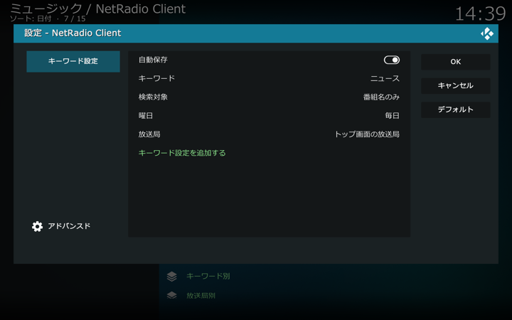

## キーワード設定画面

保存したい番組のタイトルや詳細情報にマッチさせるキーワード、放送される曜日、放送局を指定して番組保存を設定します。キーワード設定画面は[アドオン設定画面](./アドオン設定画面（一般）.md)から開くことができます。

放送局リストのコンテクストメニューから「保存設定」を選択して開くダイアログからたどって開くこともできます。詳しくは[こちら](./放送局リスト（番組保存）.md)をご覧ください。

「キーワード設定を追加する」を選択するとキーワード設定が追加されます。「OK」を選択しても追加はされないので注意してください。

#### キーワード設定の設定項目

設定する項目は以下の通りです。

##### キーワード

番組情報に含まれるキーワードを設定します。トップ画面の放送局リストの番組を対象にして、ここで設定したキーワードを番組情報に含む番組が自動的に保存されます。

##### 検索対象

上記で設定したキーワードを照合する番組情報の範囲を設定します。「番組名のみ」「番組名と詳細情報」のいずれかを選択します。

##### 曜日

番組が放送される曜日を指定します。

##### 放送局

番組保存する放送局をリストから選択します。ここで選択された放送局がトップ画面の放送局リストにない場合は、トップ画面の放送局リストに追加されます。

#### キーワード設定の変更

キーワード別保存番組ディレクトリのキーワードを右クリックして表示されるコンテクストメニューから「キーワード設定」を選択してください。
